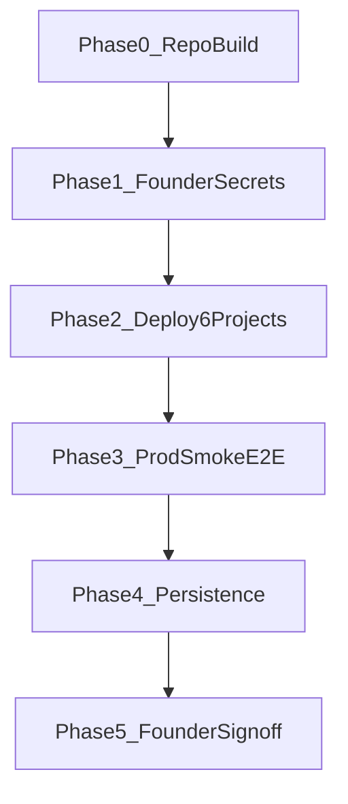

# Go-Live 10/10 Framework — nguyenai.net

**BINDING execution order for go-live.** Cập nhật: 2026-07-10  
**Evidence:** `docs/governance/QA_AUDIT_EVIDENCE_2026-07-10.md`

> Mỗi điểm chỉ PASS khi có **bằng chứng lệnh/log/E2E**, không dựa báo cáo cũ.

---

## Thang điểm 10/10

| # | Tiêu chí | Verify | Trạng thái 2026-07-10 |
|---|----------|--------|------------------------|
| 1 | **Repo QA gate** | `pnpm go-live:check` → exit 0 | ✅ 10/10 |
| 2 | **Security P0** | `pnpm audit:security-p0` | ✅ 10/10 |
| 3 | **Independence** | `pnpm audit:independence` | ✅ 10/10 (code) |
| 4 | **Product surfaces** | 64 web routes; console/edu/invest build; forms → auth/api | ✅ 9/10 |
| 5 | **SEO & brand** | 14 audits + seo-build 154 HTML; sitemap 32×2 | ✅ 9/10 |
| 6 | **Accessibility** | `pnpm audit:accessibility` → 0 violations | ✅ 10/10 |
| 7 | **Production runtime** | `pnpm audit:production-smoke` | ✅ 8/8 (2026-07-10) |
| 8 | **Persistence** | D1 `nguyenai-identity` + scholarship core | ⚠️ 5/10 |
| 9 | **Founder external** | `pnpm secrets:wrangler` + OAuth/Stripe/Resend | ⚠️ 3/10 |
| 10 | **Governance release** | Sprint 0 lock + Founder sign-off | ❌ 2/10 |

**Tổng thực tế:** ~**8/10** — production surfaces live; OAuth/payments/governance pending.

---

## Thứ tự thi công (bắt buộc)



### Phase 0 — Repo build (automated, DONE khi ALL GREEN)

```bash
pnpm install
pnpm audit:generate-sitemaps
pnpm run typecheck
pnpm run build
pnpm run audit:all          # 14 audits
pnpm run audit:seo-build
pnpm test
npx tsx tools/session-auth-regression.ts
pnpm go-live:check          # = qa-loop + regression
```

Hoặc một lệnh: `pnpm build:go-live`

### Phase 1 — Founder secrets & DB (manual)

1. Neon `DATABASE_URL`
2. Auth: `GOOGLE_CLIENT_*`, `RESEND_API_KEY`, `AUTH_SECRET`
3. API: `STRIPE_*`, `VNPAY_*`, `OPENAI/ANTHROPIC/GOOGLE_AI`, `EVIDENCE_SIGNING_KEY`
4. `pnpm db:migrate` + `pnpm db:status`

Chi tiết: `docs/deployment/FOUNDER_GO_LIVE_CHECKLIST.md`

### Phase 2 — Deploy (account `62d57eaa548617aeecac766e5a1cb98e`)

| Project | Domain |
|---------|--------|
| `nai-web` | nguyenai.net |
| `nguyenai-edu` | edu.nguyenai.net |
| `nguyenai-console` | app.nguyenai.net |
| `nguyenai-invest` | invest.nguyenai.net (sau legal review) |
| `nguyenai-api-gateway` | api.nguyenai.net |
| auth worker | auth.nguyenai.net |

### Phase 3 — Production smoke (read-only + E2E)

```bash
curl -I https://nguyenai.net/robots.txt
curl -I https://api.nguyenai.net/health
curl -I https://edu.nguyenai.net/og-default.png
curl -I https://invest.nguyenai.net/private/   # expect 302
```

E2E: register → verify → login → console → plans → chat (sandbox keys)

### Phase 4 — Persistence (engineering, post-deploy)

- Wire D1/Neon cho entitlement, scholarship, memory, evidence
- Payment webhook → grant entitlement
- Idempotency middleware mounted

### Phase 5 — Founder sign-off

- Sprint 0 governance lock
- Production release approved
- Release evidence pack cập nhật

---

## Tiêu chí “XANH TOÀN BỘ” (repo only)

| Check | Lệnh | Tiêu chí |
|-------|------|----------|
| Audits | `audit:all` | **14/14** PASS |
| Post-build SEO | `audit:seo-build` | 0 errors |
| Typecheck | `pnpm typecheck` | 0 errors |
| Build | `pnpm build` | turbo successful === total |
| Tests | `pnpm test` | 0 failures |
| QA Loop | `pnpm go-live:check` | exit 0 |

---

## Liên kết

- `MASTER_PROJECT_PLAN_2026-07-07.md` — Part 1 status
- `docs/REPO_STRUCTURE_AND_MASTER_PLAN.md` — §3 Go-live
- `docs/deployment/FOUNDER_GO_LIVE_CHECKLIST.md` — 6 bước Founder
- `docs/governance/QA_AUDIT_EVIDENCE_2026-07-10.md` — bằng chứng thực tế
